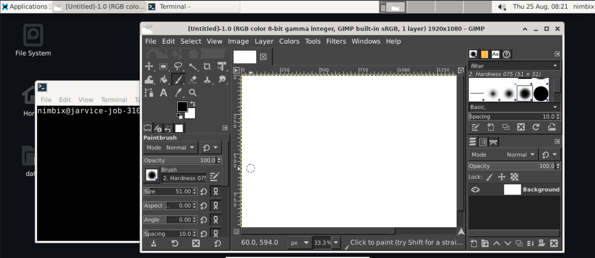

# Jarvice Desktop



Setup an Xfce4 desktop into application image to launch it as an 
interactive desktop into Jarvice portal.

Scripts will setup common packages and configuration files for Nimbix base images. This will
retrofit existing Docker images for better execution on JARVICE.

If you have an image derived from a non-Nimbix base, and you want to improve
its execution on JARVICE, there is now a simple way to do this in your
Dockerfile without having to change your FROM line.

Supported distributions:
* RHEL like (EL) 7, 8 (x86_64)
* Ubuntu 18.04, 20.04 and 22.04 (x86_64)

Just add this to the end of your Dockerfile:

# Ubuntu
```bash
RUN apt-get -y update && \
    DEBIAN_FRONTEND=noninteractive apt-get -y install curl --no-install-recommends && \
    curl -H 'Cache-Control: no-cache' \
        https://raw.githubusercontent.com/nimbix/jarvice-desktop/master/install-nimbix.sh \
        | bash
```

# RHEL likes
```bash
RUN curl -H 'Cache-Control: no-cache' \
        https://raw.githubusercontent.com/nimbix/jarvice-desktop/master/install-nimbix.sh \
        | bash
```

This does several things:
 1. installs recommended packages for running on JARVICE
 3. sets up the nimbix user, and gives it password-less sudo access (requires privilege escalation unlocked cluster)
 4. configures JARVICE "emulation" for local testing (see our PushToCompute tutorial for more on that)
 5. preserves the Docker environment variables and makes sure they are set when you run in JARVICE as well

 Please report us any issues.
